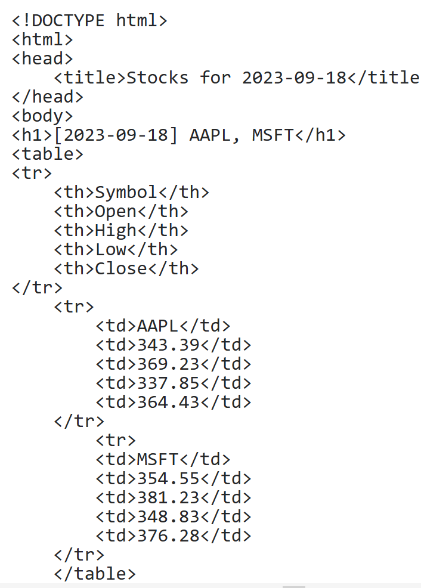

# Task
Get stock information from HTML

We have a date and a list of stock symbols.

## Goal:
return stock information for each symbol at the given date.

To get stock information, we need to call the stocks server that runs on the current machine port 8988.
Example HTTP request:

```GET /stocks?date=2023-09-18&sym=AAPL&sym=MSFT```


How result must be:
```
#Return a list of values for symbols at date.
    >>> stock_info(datetime(2023, 9, 18), ['MSFT'])
    [{'symbol': 'MSFT', 'open': 354.55, 'high': 381.23, 'low': 348.83, 'close': 376.28}]
```

# workflow:
Use imports:
urllib.parse - urlencode
urllib.request urlopen
bs4.beautifulsoup

